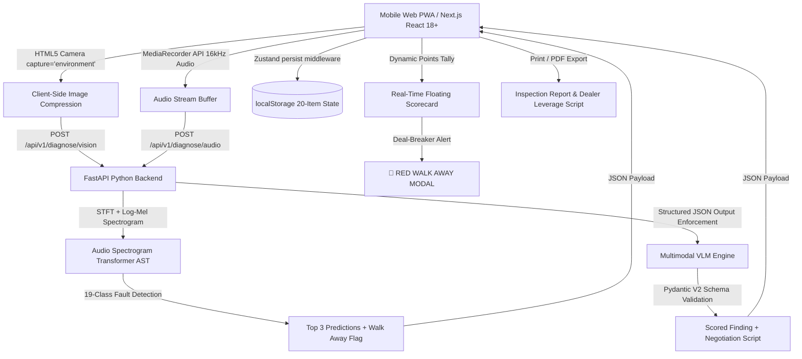

# 🚗 AI-Powered Car Pre-Purchase Inspection & Diagnostic App

A mobile-first, local-first Progressive Web App (PWA) and asynchronous Python backend designed for used vehicle pre-purchase inspections in the field.

---

## 🌟 System Architecture Overview



---

## 📋 5 Inspection Stations & 20-Point Rubric

### **Station 1: Cold Engine Bay & Fluids**
- **S1-01: Oil Filler Cap Underside**
  - *Clean, amber / dry* (`+2 pts`)
  - *Dark carbon varnish* (`-2 pts`)
  - *Milkshake, foamy* (`-10 pts` • **WALK CONDITION**)
- **S1-02: Oil Dipstick Level & Quality**
  - *Clean, amber level* (`+3 pts`)
  - *Dark, overdue oil* (`-2 pts`)
  - *Dry / Below min line* (`-4 pts`)
  - *Milkshake, foamy* (`-10 pts` • **WALK CONDITION**)
- **S1-03: Coolant Reservoir & Radiator Cap**
  - *Bright OEM clean* (`+2 pts`)
  - *Murky / sediment* (`-2 pts`)
  - *Oil slick / milky mix* (`-10 pts` • **WALK CONDITION**)
- **S1-04: Brake Fluid Reservoir**
  - *Clear / light honey* (`+2 pts`)
  - *Dark brown / moisture* (`-2 pts`)
  - *Pitch black / sediment* (`-4 pts`)
- **S1-05: Battery Terminals & Age Code**
  - *Clean, sealed posts (<3 yrs)* (`+2 pts`)
  - *Minor acid crust* (`-1 pt`)
  - *Heavy corroded crust (5+ yrs)* (`-3 pts`)

### **Station 2: Engine Mechanical & Acoustic (AST AI)**
- **S2-01: Front Engine Timing Cover Seam**
  - *Bone dry* (`+3 pts`)
  - *Slightly damp* (`-2 pts`)
  - *Wet, grimy* (`-5 pts`)
- **S2-02: Valve Cover Gasket Perimeter**
  - *Bone dry / clean* (`+2 pts`)
  - *Weeping around bolts* (`-2 pts`)
  - *Heavy pooled oil* (`-4 pts`)
- **S2-03: Cold Idle Acoustic AST Scan (750 RPM)**
  - *Healthy harmonic idle* (`+3 pts`)
  - *Lifter tick / Vacuum leak* (`-2 pts`)
  - *Rod knock / Bearing failure* (`-10 pts` • **WALK CONDITION**)
- **S2-04: Rev & Decel Acoustic AST Scan (2,500 RPM)**
  - *Linear spool & smooth decel* (`+2 pts`)
  - *Timing chain rattle / Misfire* (`-4 pts`)
  - *Turbo siren / Piston slap* (`-5 pts`)
- **S2-05: Serpentine Accessory Belt & Pulleys**
  - *Supple, ribbed, no cracks* (`+2 pts`)
  - *Micro-cracks / dry rot* (`-2 pts`)
  - *Frayed edges / misaligned* (`-3 pts`)

### **Station 3: Underbody, Drivetrain & Suspension**
- **S3-01: Front CV Axle Rubber Boots**
  - *Intact, supple, sealed* (`+2 pts`)
  - *Surface hairline checks* (`-1 pt`)
  - *Torn, slinging dark grease* (`-3 pts`)
- **S3-02: Engine Oil Pan & Transmission Bellhousing**
  - *Clean, dry metal* (`+3 pts`)
  - *Minor oil seepage* (`-2 pts`)
  - *Active dripping / wet casing* (`-5 pts`)
- **S3-03: Subframe & Frame Rails Structural Rust**
  - *Clean paint / e-coat* (`+3 pts`)
  - *Light surface patina* (`0 pts`)
  - *Perforated rot / flaky rust* (`-10 pts` • **WALK CONDITION**)
- **S3-04: Shock Absorbers & Strut Dampers**
  - *Dry shaft, firm dampening* (`+2 pts`)
  - *Hydraulic oil misting* (`-2 pts`)
  - *Wet dripping blown strut* (`-4 pts`)

### **Station 4: Exterior, Structural & Tires**
- **S4-01: Fender & Hood Panel Gaps**
  - *Uniform 3-4mm laser aligned* (`+2 pts`)
  - *Minor uneven gap (5-6mm)* (`-2 pts`)
  - *Crooked / rubbing panels* (`-4 pts`)
- **S4-02: Inner Aprons & Core Support Crash Signs**
  - *Factory spot welds & sealer* (`+3 pts`)
  - *Minor plastic clip broken* (`-1 pt`)
  - *Kinked metal / aftermarket welds* (`-10 pts` • **WALK CONDITION**)
- **S4-03: Paint Depth & Body Filler / Bondo**
  - *Consistent factory orange peel* (`+2 pts`)
  - *Repainted panel / overspray* (`-2 pts`)
  - *Heavy bondo mud / bubbling rust* (`-4 pts`)
- **S4-04: Tire Tread Depth & Wear Pattern**
  - *Even 6/32"+ tread depth* (`+2 pts`)
  - *Inner / outer shoulder bald* (`-3 pts`)
  - *Severe dry rot / sidewall bubble* (`-4 pts`)

### **Station 5: Cabin, OBD-II & Road Test**
- **S5-01: Cold Start Tailpipe Smoke**
  - *Clear / brief water vapor* (`+2 pts`)
  - *Black sooty / rich mixture* (`-3 pts`)
  - *Blue puff / oil consumption* (`-10 pts` • **WALK CONDITION**)
  - *Billowing sweet white smoke* (`-10 pts` • **WALK CONDITION**)
- **S5-02: Instrument Warning Lights / OBD Readiness**
  - *All bulbs self-test & extinguish* (`+3 pts`)
  - *TPMS / minor maintenance lamp* (`-1 pt`)
  - *ABS / Airbag SRS light ON* (`-4 pts`)
  - *Check Engine Light ON* (`-5 pts`)
- **S5-03: Transmission Gear Engagement (P to D / R)**
  - *Crisp, immediate lock-in (<0.5s)* (`+2 pts`)
  - *Slight hesitation (1.0s)* (`-2 pts`)
  - *Hard violent clunk / slipping delay* (`-5 pts`)
- **S5-04: HVAC System (A/C & Heat Performance)**
  - *Sub-45°F A/C & boiling heat* (`+2 pts`)
  - *Slow cooling (55°F)* (`-2 pts`)
  - *Hot air only / Compressor dead* (`-4 pts`)

---

## 🎧 19 Acoustic Fault Classes (AST)

1. **Rod Knock** (WALK CONDITION • Fatal journal bearing clearance loss)
2. **Main Bearing Knock** (WALK CONDITION • Lower block oil pressure failure)
3. **Piston Slap** (TDC cylinder bore clearance wear)
4. **Lifter / Tappet Tick** (Half-speed valvetrain click)
5. **Timing Chain / Tensioner Rattle** (Chain stretch clatter)
6. **Vacuum Leak / Intake Hiss** (High-frequency unmetered air suction)
7. **Serpentine Belt Squeal** (2.2 kHz pulley friction chirp)
8. **Idler / Tensioner Pulley Bearing Whine** (Dry bearing friction)
9. **Alternator Bearing / Diode Whine** (RPM-locked electromagnetic whine)
10. **Water Pump Bearing Noise** (Coolant pump bearing rattle)
11. **Power Steering Pump Groan** (Hydraulic cavitation groan)
12. **A/C Compressor Clutch Rattle** (Clutch bearing clatter)
13. **Exhaust Manifold Leak** (Sharp cold-start exhaust puff)
14. **Catalyst Substrate Rattle** (Broken catalytic ceramic honeycomb)
15. **Engine Misfire / Uneven Idle** (Erratic combustion cadence)
16. **Turbocharger Bearing Whine** (Police siren boost wail)
17. **Healthy Engine Idle** (Smooth 750 RPM combustion harmonic cycle)
18. **Healthy Engine Rev / Decel** (Linear throttle spool & RPM decay)
19. **Heavy Background Noise / Indeterminate** (Obscured / wind buffeting)

---

## 🚀 Quickstart Guide

### Option 1: Start Both Frontend and Backend with One Command
```bash
./start.sh
```

### Option 2: Run Separately

**Backend (FastAPI):**
```bash
cd backend
./venv/bin/uvicorn app.main:app --host 0.0.0.0 --port 8000 --reload
```
API Documentation available at: `http://localhost:8000/docs`

**Frontend (Next.js):**
```bash
cd frontend
npm run dev
```
Open your browser at: `http://localhost:3000`

---

## 📱 Core Features

1. **Progressive Web App (PWA)**: Works offline and preserves all inspection progress across browser tab closures using Zustand `persist` with `localStorage`.
2. **Client-Side Image Compression**: Automatically downscales 12MP+ camera photos to 1920px before sending, cutting payload size by ~90% over cellular connections.
3. **Real-Time Dynamic Floating Scorecard**: Live tally of +/- points, health percentage gauge, and instant **RED WALK AWAY** banner on fatal deal-breakers.
4. **"I Can't See That" Error Fallback**: Amber alert notification when a photo is blurry, dark, or obscured with a 1-click retake action.
5. **Acoustic Waveform & Spectrogram Visualizer**: Live real-time canvas waveform and 16-band Mel energy spectrum display with top 3 condition confidence ratings.
6. **Negotiation Script Generator & Repair Estimator**: Generates dealer talking points and calculates immediate repair costs ($USD) to deduct from the asking price.
7. **Print / PDF Inspection Report**: Full printable executive summary report.
